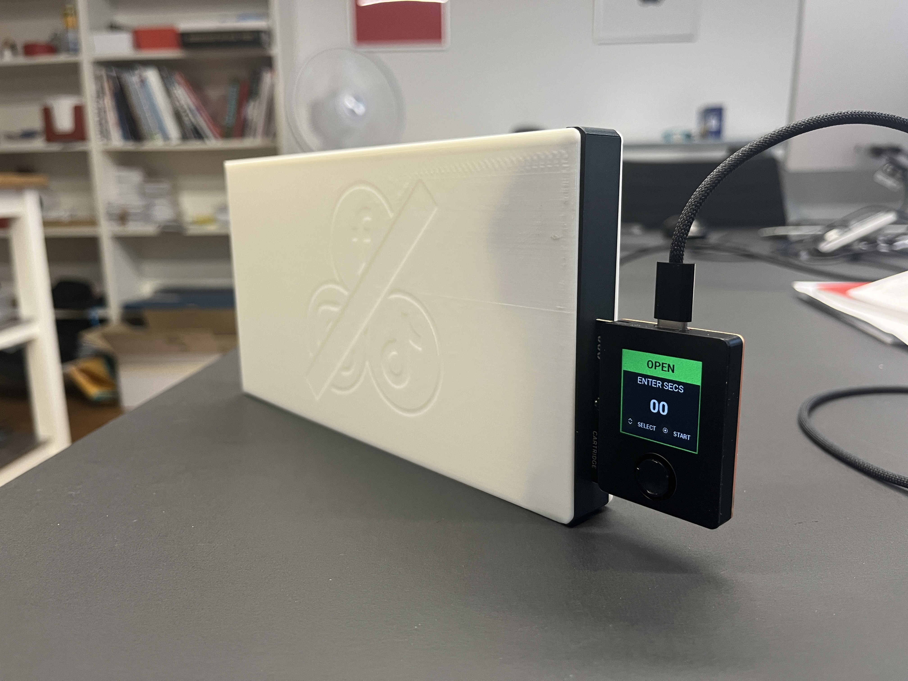

Maker Media GmbH

***

# Tresorsteuerung mit der Oxocard

### Am Beispiel eines Smartphone-Tresors zeigen wir, wie man mit dem Oxocard Connect Innovator Kit, einem 3D-Drucker sowie etwas Elektronik programmierbare Schlösser und Safes entwickelt.

Das Projekt unseres Smartphone-Tresors ist ein vereinfachtes Beispiel für einen programmgesteuerten Verschlussmechanismus. Er zeigt alle wesentlichen Elemente einer elektronisch abgesicherten Ablage. Durch die eher modellhafte Ausführung bietet der Tresor jedoch keine effektive Absicherung gegen Diebstahl und auch keinen Schutz vor gewaltsamen Öffnungsversuchen.

Den vollständigen Artikel mit der Bauanleitung gibt es in der [Make-Ausgabe 1/2025 ab Seite 76](https://www.heise.de/select/make/2025/1/2433910000196521552). Hier finden Sie die 3D-Druckdateien sowie die Programme für die NanoPy-IDE als Download.
